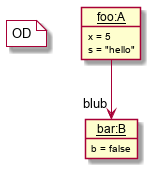
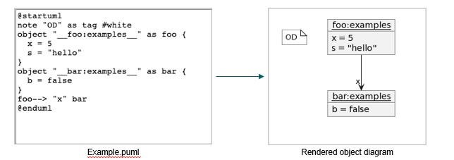

# Object Diagram PlantUML Tool (ODPlantUMLTool)

The [ODPlantUMLTool](src/main/java/de/monticore/ODPlantUMLTool.java) is a Pretty Printer primarily used to pretty print the `Object Diagram` models as `PlantUML` models and further generate the object diagrams as an `image`.

## Features

1. Parse the `Object Diagram` models
   1. The tool takes the `Object Diagram` models as input and parses them into `Abstract Syntax Tree` (AST) representation based on suitable [grammars](src/main/grammars).
   2. The [OD4Report](src/main/grammars) grammar is used to parse the `Object Diagram` models.

### Example Model


<br><b>Figure 1:</b> The graphical syntax of an example OD.


Figure 1 depicts the OD ```Example``` in graphical syntax. In textual syntax, the OD is defined as
follows:

``` 
objectdiagram Examples {

  foo: A {
    int x = 5;
    java.lang.String s = "hello";
  };

  bar: B {
    boolean b = false;
  };

  link foo -> (blub) bar;

}
```

This was for us the most intuitive textual representation of ODs, which follows the syntax of class
diagrams.


2. Pretty Print the `Object Diagram` model as a `PlantUML` model.
    1. The tool uses the [Monticore](https://monticore.github.io/monticore/) `Visitor` and `Handler` Infrastructure to iterate through the `Abstract Syntax Tree` nodes and pretty print the `PlantUML` model.
    2. Detailed Implementation can be found here: [PlantUMLODFullPrettyPrinter](src/main/java/de/monticore/PlantUMLODFullPrettyPrinter.java)

``` 
@startuml
note "OD" as tag #white
object "__foo:A__" as foo {
  x = 5 
  s = "hello"
}
object "__bar:B__" as bar {
  b = false 
}
foo--> "blub" bar
@enduml
```


This is the pretty-printed `PlantUML` model by the ODPlantUMLTool    

3. Generate an image representing the `Object Diagram` from the pretty printed `PlantUML` Model.
    1. The tool use suitable PlantUML Java libraries to take the pretty printed `PlantUML` model as input and generate an image representing the `Object Diagram`.
    2. Detailed Implementation can be found here: [generateImage](src/main/java/de/monticore/ODPlantUMLTool.java) 



<br><b>Figure 2:</b> Generation of Object Diagram from PlantUML Model.

## Usage of ODPlantUMLTool

### Dependencies 
* Java 11
* Gradle 7.5

### Installation of the project
* Clone the project from Gitlab
* run *./gradlew clean*
* run *./gradlew build*

### Running the application

* The tool can be found here: [ODPlantUMLTool](src/main/java/de/monticore/ODPlantUMLTool.java)


* Run the Tool using the following CLI arguments:
  * ``` -i gentest/src/main/resources/Example.od -s gentest/src/main/resources/symboltable -pp diagram.png ```


* Explanation of the CLI arguments:
    * ``` -i ``` flag is used to specify the location of the input `Object Diagram` model
    * ``` -s ``` flag is used to specify the location of the symbol table that must be used by the `Pretty Printer`.
    * ``` pp ``` flag is used to specify the name of the output image of the `Object Diagram` that is generated from the pretty printed `PlantUML` model.
    * These arguments values can be *modified according to individual user's requirements* like format of images (png, jpeg), location of models etc.


* To view the pretty printed `PlantUML` model, then following steps must be performed: 
    * Navigate to the tool: [ODPlantUMLTool](src/main/java/de/monticore/ODPlantUMLTool.java)
    * Move to the `prettyPrint` function at `Line 124`
    * Add and additional fragment to print the result `PlantUML model` at `Line 127` : Log.info(result,"INFO");
    * Build the project again.
    * Run the `PlantUML` Tool using suitable CLI arguments.
    * The pretty printed `PlantUML` model will be available in the logs.


## Further Information

* [Project root: MontiCore @github](https://github.com/MontiCore/monticore)
* [MontiCore documentation](http://www.monticore.de/)
* [**List of languages**](https://github.com/MontiCore/monticore/blob/opendev/docs/Languages.md)
* [**MontiCore Core Grammar
  Library**](https://github.com/MontiCore/monticore/blob/opendev/monticore-grammar/src/main/grammars/de/monticore/Grammars.md)
* [Best Practices](https://github.com/MontiCore/monticore/blob/opendev/docs/BestPractices.md)
* [Publications about MBSE and MontiCore](https://www.se-rwth.de/publications/)
* [Licence definition](https://github.com/MontiCore/monticore/blob/master/00.org/Licenses/LICENSE-MONTICORE-3-LEVEL.md)

[od4report-link]: http://www.monticore.de/download/MCOD4Report.jar

[od4data-link]: http://www.monticore.de/download/MCOD4Data.jar