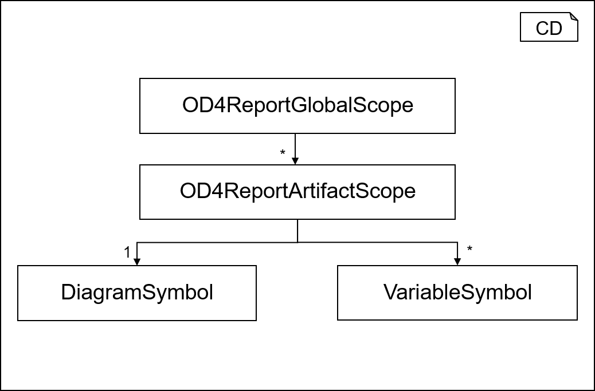
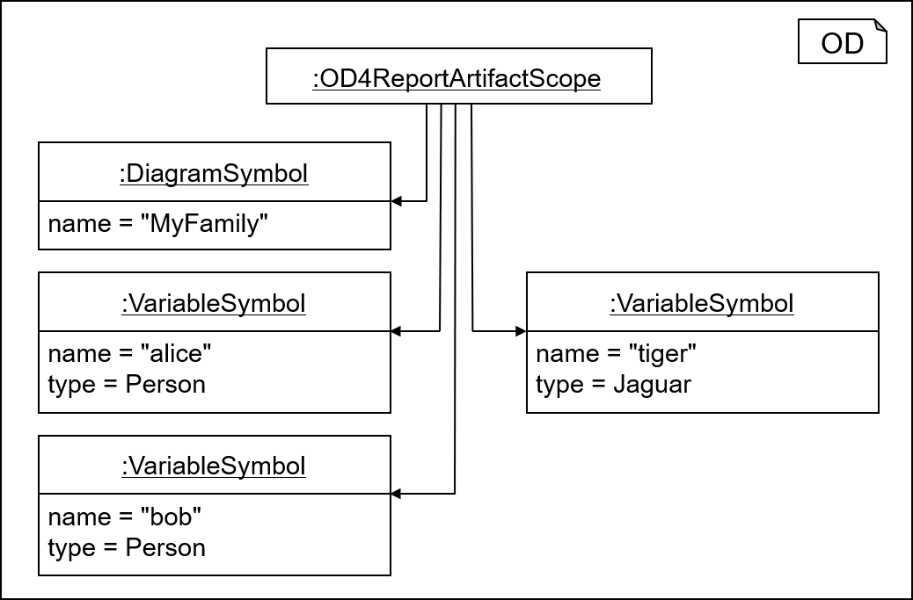

<!-- (c) https://github.com/MontiCore/monticore -->

<!-- Beta-version: This is intended to become a MontiCore stable explanation. -->

# (UML/P) Object Diagrams

Object diagrams are a sublanguage provided by the *UML*.
UML/P ODs are an OD variant suited e.g. for the 
modeling of for *desired and unwanted object structures*,
or can be used as *setup definitions for tests* or their desired outcomes.
UML/P ODs are suited for combination e.g. with the 
object constraint language OCL
(details can be found in [Rum16], [Rum17]).

This MontiCore project contains 
* seven language components, defined by their own grammars, 
* appropriate context conditions for each language component, 
* which also includes a symbol table infrastructure 
  for managing and storing symbol tables, and
* pretty-printers. 

## Example Model
In textual syntax, an example OD is defined as follows:

``` 
objectdiagram MyFamily {
  alice:Person {
    age = 29;
    cars = [
      :BMW {
        color = BLUE;
      },
      tiger:Jaguar {
        color = RED;
        length = 5.3;
      }
    ];
  };
  bob:Person {
    nicknames = ["Bob", "Bobby", "Robert"];
    cars = [tiger];
  };
  link married alice <-> bob;
}
```

XXX TODO: Teaser mit einem nested link erweitern und mit einer Datumsangabe (zB birth ...)

A graphical version is shown in Figure 1. 


<br><b>Figure 1:</b> The graphical syntax of example OD MyFamiliy. <br/>

&nbsp;  

The conceptual elements of ODs are similar to JSOM or XML, but deliver (hopefully) a better readable syntax:

* *Objects* have a name, e.g. `alice`, which can be used for link structures.
* Objects also have a *type*, e.g. `:Person`. 
* UML allows both to be optional, if not needed or reconstructable from context.
* *Attributes* are defined with their value, e.g. `color = RED`.
* *Link*s can be explicitly defined, allowing *arbitrary graph structures*, e.g. 
  use of `tiger` or the `alice <-> bob` link. 
* All native *datatypes*, such as `int`, `Boolean`, `float`, `String`, are supported, 
  as well as *lists*, *maps*, and compact representations of *dates*.
* *Nested objects* are supported as well, allowing to in-line object structures 
  that finally form a *tree of data objects*:
  This reduces the effort to write explicit links, 
  because explicit links are only needed when crossing the tree structure.

Below follow more detailed explanations about the project:


## Tools `OD4ReportCLI` and  `ODDataCLI`

By default the project creates two tools, stored in `OD4ReportCLI.jar` and  `ODDataCLI.jar`.

[```OD4ReportCLI```](../../java/de/monticore/od4report/OD4ReportCLI.java) provides typical functionality used when
processing models from commandline (CLI). To this effect, the class provides methods
for parsing, pretty-printing, creating symbol tables, storing symbols, and 
loading symbols. Detailed information about the methods can be found in the Javadoc documentation
of the class [```OD4ReportCLI```](../../java/de/monticore/od4report/OD4ReportCLI.java).

[```OD4DataCLI```](../../java/de/monticore/od4report/OD4DataCLI.java) ... XXX TODO

Each CLI can be found in the ```target``` folder once the project build was successful. 
Each CLI provides a ``-h`` parameter
providing further information on how to use the CLI.

Example calls:

```
  java -jar target/libs/OD4DataCLI.jar -h
  java -jar target/libs/OD4ReportCLI.jar -h
  
  // pretty print an OD:
  java -jar target/libs/OD4ReportCLI.jar -i src/test/resources/examples/od/Teaser.od \
           -pp

  // read an OD and store the symbols it defines and exports in a symboltable:
  java -jar target/libs/OD4DataCLI.jar -i src/test/resources/examples/od/Teaser.od \
           -s Teaser.symod
```

## Grammars (i.e. language components)

This MontiCore project contains seven grammars, which provide 
the possibility to describe object diagrams in various extensions:

* [ODBasis](../../../grammars/de/monticore/ODBasis.mc4), 
* [ODAttribute](../../../grammars/de/monticore/ODAttribute.mc4), 
* [ODLink](../../../grammars/de/monticore/ODLink.mc4), 
* [OD4Data](../../../grammars/de/monticore/OD4Data.mc4), 
* [OD4Report](../../../grammars/de/monticore/OD4Report.mc4), and 
* [DateLiterals](../../../grammars/de/monticore/DateLiterals.mc4). 


### ODBasis

The grammar [ODBasis](../../../grammars/de/monticore/ODBasis.mc4) 
contains the basic constituents to define textual 
representations of UML/P ODs. 

The grammar [ODBasis](../../../grammars/de/monticore/ODBasis.mc4) defines the syntax for 
* OD artifacts, 
* objects, which can be named and anonymous, and optionally can have types, and 
* simple object attributes.  
                            
The grammar [ODBasis](../../../grammars/de/monticore/ODBasis.mc4) extends the grammars
* [MCBasicTypes](https://github.com/MontiCore/monticore/blob/dev/monticore-grammar/src/main/grammars/de/monticore/types/MCBasicTypes.mc4) that provides possible object types.
* [OOSymbols](https://github.com/MontiCore/monticore/blob/dev/monticore-grammar/src/main/grammars/de/monticore/symbols/OOSymbols.mc4) for using symbols of kind `Diagram` and `Variable`.
* [CommonExpressions](https://github.com/MontiCore/monticore/blob/dev/monticore-grammar/src/main/grammars/de/monticore/expressions/CommonExpressions.mc4) to be able to reuse simple forms of 
expressions (and the typechecking functionality).
* [UMLStereotype](https://github.com/MontiCore/monticore/blob/dev/monticore-grammar/src/main/grammars/de/monticore/UMLStereotype.mc4) for adding UMLStereotypes as possible extension points to the grammar. 

### ODAttribute

The grammar [ODAttribute](../../../grammars/de/monticore/ODAttribute.mc4) adds more complex types of 
attributes, i.e. *lists* and *maps*, to UML/P ODs. 

The grammar [ODAttribute](../../../grammars/de/monticore/ODAttribute.mc4) defines the syntax for
* lists of values,
* and maps of key-value pairs.

XXX TODO: ist es notwendig dies in der Grammatik einzusetzen? 
[MCFullGenericTypes](https://github.com/MontiCore/monticore/blob/dev/monticore-grammar/src/main/grammars/de/monticore/types/MCFullGenericTypes.mc4) for using symbols of kind Diagram und Variable.


### ODLink
The grammar [ODLink](../../../grammars/de/monticore/ODLink.mc4) adds links to UML/P ODs. 
There are two main types of link representations, namely the explicit mentioning as `link` 
that connects two objects and the nested link, that occurs when the nesting objects into a hierarchy.

Furthermore, links may be *directed* and can be *ordinary*, *aggregations* or *compositions*, but also 
*derived*.


### OD4Data
The grammar [OD4Data](../../../grammars/de/monticore/OD4Data.mc4) only combines the 
language components `ODAttribute` 
and `ODLink` to form a variant of OD language mainly used for representing data. For that purpose, 
the language component also offers 
to use *dates* as expressions in certain structures of a model, e.g. attribute values.

### OD4Development
The [OD4Development](../../../grammars/de/monticore/OD4Development.mc4) grammar extends the `OD4Data` language 
by adding an extended namespace for objects and attribute values. 

It focusses on the modelling phase in typical object-oriented development
projects and is therefore mainly used for data modelling. Consequently, it omits method signatures
and complex generics. 

`OD4Development` is the textual representation to describe UML object diagrams
(it uses the UML/P variant). `OD4Development` covers objects, attributes with values (and optional) types,
and all kinds of associations and composition,  including qualified and ordered associations.
It allows to define 
* (1) desired object structures,
* (2) unwanted object structures,
* (3) initial object structures e.g. for a test setup or the specifictaion of a construction method.
It allows incomplete structures (omitting uninteresting
links or attributes); values can be either given directly or as
expressions using other values and thus also allows to describe
* (4) desired test results (oracle), and has also been used for
* (5) object pattern, for a pattern matching algorithm.

`OD4Development` fits very well to the `CD4Analysis`language component.

It builds on MCTypes, but disallows e.g. List<int> as type, 
because they can be represented via associations.


### OD4Report 
The [OD4Report](../../../grammars/de/monticore/OD4Report.mc4) grammar extends the `OD4Data` language 
by adding an extended namespace for objects and attribute values. 
Its main appliciation are reporting, e.g. in MontiCore's generated reports, 
or data formats which need make use of the extended namespace, e.g. artifact-based analyses. 
For that purpose, it mainly extends the possibility to define names by nonterminal `ODSpecialName`, 
which encodes a number of additional information into the object name. An example for such 
a special name is `@State(2,3)` encoding, that this state has occurred in line 2, column 3.


### DateLiterals

The grammar [DateLiterals](../../../grammars/de/monticore/DateLiterals.mc4) 
introduces nonterminal `Date` as a mechanism to describe dates and times 
in several forms. These forms of dates can be added to the Literals universe,
and thus provide native language support for dates and times.
Dates consist
of a date part modeling year, month, and day, as well as a time part, modeling hour, minute, and 
second. 

The above defined object diagrams, especially the `OD4Report` language component
makes heavy use of this possbility.

## Context Conditions

This section lists the context conditions for the [ODBasis](../../../grammars/de/monticore/ODBasis.mc4) grammar, 
context conditions for the [ODAttribute](../../../grammars/de/monticore/ODAttribute.mc4) grammar,
context conditions for the [ODLink](../../../grammars/de/monticore/ODLink.mc4) grammar,
context conditions for the [OD4Data](../../../grammars/de/monticore/OD4Data.mc4) grammar
context conditions for the [OD4Development](../../../grammars/de/monticore/OD4Development.mc4) grammar.
context conditions for the [OD4Report](../../../grammars/de/monticore/OD4Report.mc4) grammar.
context conditions for the [DateLiterals](../../../grammars/de/monticore/DateLiterals.mc4) grammar.

### ODBasis Context Conditions
The implementations of the context conditions for the [ODBasis](../../../grammars/de/monticore/ODBasis.mc4) grammar are located [here](../../../java/de/monticore/odbasis/_cocos).

* The context condition [```NoAbstractAttributesCoCo```](../../../java/de/monticore/odbasis/_cocos/attributes/NoAbstractAttributesCoCo.java) checks if an object contains an abstract attribute.

* The context condition [```PartialAndCompleteAttributesCoCo```](../../../java/de/monticore/odbasis/_cocos/attributes/PartialAndCompleteAttributesCoCo.java) ensures that attributes defined with a partial operator are not defined in a complete attribute definition and vice versa.

* The context condition [```UniqueAttributeNamesCoCo```](../../../java/de/monticore/odbasis/_cocos/attributes/UniqueAttributeNamesCoCo.java) checks whether the attribute names within an object are unique.

* The context condition [```UniqueObjectNamesCoCo```](../../../java/de/monticore/odbasis/_cocos/names/UniqueObjectNamesCoCo.java) checks if object names are not unique in a diagram.

* The context condition [```ValidObjectReferenceCoCo```](../../../java/de/monticore/odbasis/_cocos/object/ValidObjectReferenceCoCo.java) checks object references as an attribute value actually exist. 

### ODAttribute Context Conditions
None.

### ODLink Context Conditions
The implementations of the context conditions for the [ODLink](../../../grammars/de/monticore/ODLink.mc4) grammar are located [here](../../../java/de/monticore/odlink/_cocos).

* The context condition [```LinkEndConsistencyCoCo```](../../../java/de/monticore/odlink/_cocos/link/LinkEndConsistencyCoCo.java) checks whether named links consists of the same object type references on the left and right side of a link.
                                                                                                                              
* The context condition [```NoAbstractLinkCoCo```](../../../java/de/monticore/odlink/_cocos/link/NoAbstractLinkCoCo.java) checks if links have an abstract modifier. 

* The context condition [```ValidLinkReferenceCoCo```](../../../java/de/monticore/odlink/_cocos/link/ValidLinkReferenceCoCo.java) checks if the object referenced actually exist.

### OD4Data Context Conditions
None.

### OD4Development Context Conditions
None.

### OD4Report Context Conditions
None.

### DateLiterals Context Conditions
The implementations of the context conditions for the [DateLiterals](../../../grammars/de/monticore/DateLiterals.mc4) grammar are located [here](../../../java/de/monticore/dateliterals/_cocos).

* The context condition [```DateConcistencyCoCo```](../../../java/de/monticore/dateliterals/_cocos/date/DateConcistencyCoCo.java) checks if a date is consistent in termns of day of year as well as time of day.


## Symbol Table
The OD language family uses the built-in symbol types [```VariableSymbol```][BasicSymbolsRef]
and [```DiagramSymbol```][BasicSymbolsRef] as well as the [type symbol types][TypeSymbolsRef] of MontiCore. 

Each OD may define objects. Therefore, ODs may export [```VariableSymbols```][BasicSymbolsRef] 
containing the information about the name and the type of the objects defined. 
Possible types for objects are [```MCObjectTypes```][MCBasicTypesRef].
Furthermore, for checking whether the types of objects and variables
are existing and the OD is welldefined, ODs may import [```TypeSymbols```][BasicSymbolsRef] 
and [```OOTypeSymbols```][OOSymbolsRef]. 


### Symbol Table Data Structure


<br><b>Figure 2:</b> The data structure of the symbol table of the OD language.

&nbsp;  

Figure 2 depicts the symbol table data structure of the [```OD4Report```](../../../grammars/de/monticore/OD4Report.mc4) language. The ```OD4ReportGlobalScope``` is associated to an
```OD4ReportArtifactScope``` for each artifact defining an OD. In each
of these artifacts, at exactly one OD can be defined and each OD introduces 
a [```DiagramSymbol```][BasicSymbolsRef]. 
Therefore, each ```OD4DReportArtifactScope``` is associated to exactly one 
[```DiagramSymbol```][BasicSymbolsRef]. 
The ```OD4ReportArtifactScope```
contains a [```VariableSymbol```][BasicSymbolsRef] for each named object that is defined inside the 
OD. 

XXX TODO: Stimmt das mit dem OD4DReportArtifactScope noch? (im storage taucht der ja nicht auf)


<br><b>Figure 3:</b> Symbol table instance of the OD depicted in Figure 1.

&nbsp;  

Figure 3 depicts the symbol table instance for the OD ```MyFamily```. 
The three explicitly named objects 
```alice:Person```, ```bob:Person``` and  ```tiger:Jaguar``` are stored as  
 [```VariableSymbol```][BasicSymbolsRef]
 instances and maintaiend i the ```OD4ReportArtifactScope```. 
 The object ```:DiagramSymbol``` containing the name of the object diagram is also 
 linked to that scope. 

As usual, symbols can only be accessed, if they have an explicit name, which is why
an anonymous object, such as `:BMW`, as well as any form of links 
do not occur in the symbol table. Please also note, that types, such as `BMW` or `Person`
are imported by the object diagram, but not internally defined.

Handwritten extensions of the symbol table creator can be found as follows:
 * The creator for the [```ODBasis```](../../../grammars/de/monticore/ODBasis.mc4) grammar can be found in the class  [```ODBasisSymbolTableCreator```](../../../java/de/monticore/odbasis/_symboltable/ODBasisSymbolTableCreator.java). 
 * The creator for the [```ODAttribute```](../../../grammars/de/monticore/ODAttribute.mc4) grammar can be found in the class  [```ODAttributeSymbolTableCreator```](../../../java/de/monticore/odattribute/_symboltable/ODAttributeSymbolTableCreator.java). 
 * The creator for the [```ODLink```](../../../grammars/de/monticore/ODLink.mc4) grammar can be found in the class  [```ODLinkSymbolTableCreator```](../../../java/de/monticore/odlink/_symboltable/ODLinkSymbolTableCreator.java). 
 * The creator for the [```OD4Report```](../../../grammars/de/monticore/OD4Report.mc4) grammar can be found in the class  [```OD4ReportSymbolTableCreator```](../../../java/de/monticore/od4report/_symboltable/OD4ReportSymbolTableCreator.java). 
  
### Symbol kinds used by the OD Language (importable or subclassed)
The OD language uses symbols of kind [```TypeSymbol```][BasicSymbolsRef],
[```VariableSymbol```][BasicSymbolsRef], and
[```DiagramSymbol```][BasicSymbolsRef].

### Symbol kinds defined by the OD language (exported):
None.

### Symbols imported by OD models:
* ODs import [```VariableSymbols```][BasicSymbolsRef] as externally defined objects. 
The importet objects 
can be used as attribute values and link targets.
* ODs import [```TypeSymbols```][BasicSymbolsRef] that can be used as types for objects.

### Symbols exported by OD models:
* OD models export objects in form of [```VariableSymbols```][BasicSymbolsRef], i.e. all
  objects with explicit names are visible from outside the object diagram. 
  There is no hiding, not even for nested objects (this was a deliberate design decision;
  alternatives would have been possible.)
  With this mechanism, object diagrams can extend each other, defining a more complex object
  structure in several artefacts.

* Each OD exports exactly one [```DiagramSymbol```][BasicSymbolsRef] corresponding to the ODArtifact.

### Serialization and De-serialization of Symbol Tables
The OD language uses the DeSer implementations as generated by MontiCore
without any additional handwritten extensions. The following 
depicts the symbol file obtained from serializing the symbol table instance 
depicted in Figure 3:

XXX tODO: Schon mal entfernt;  "kindHierarchy":  Sichern, dass dies so wird.

```json
{
  "generated-using": "www.MontiCore.de technology",
  "symbols": [
    {
      "kind": "de.monticore.symbols.basicsymbols._symboltable.VariableSymbol",
      "name": "alice",
      "type": {
        "kind": "de.monticore.types.check.SymTypeOfObject",
        "objName": "Person"
      },
      "isReadOnly": false
    },
    {
      "kind": "de.monticore.symbols.basicsymbols._symboltable.VariableSymbol",
      "name": "tiger",
      "type": {
        "kind": "de.monticore.types.check.SymTypeOfObject",
        "objName": "Jaguar"
      },
      "isReadOnly": false
    },
    {
      "kind": "de.monticore.symbols.basicsymbols._symboltable.VariableSymbol",
      "name": "bob",
      "type": {
        "kind": "de.monticore.types.check.SymTypeOfObject",
        "objName": "Person"
      },
      "isReadOnly": false
    },
    {
      "kind": "de.monticore.symbols.basicsymbols._symboltable.DiagramSymbol",
      "name": "MyFamily"
    }
  ]
}
```

[BasicSymbolsRef]:https://github.com/MontiCore/monticore/blob/dev/monticore-grammar/src/main/grammars/de/monticore/symbols/BasicSymbols.mc4
[TypeSymbolsRef]:https://github.com/MontiCore/monticore/tree/dev/monticore-grammar/src/main/grammars/de/monticore/types
[MCBasicTypesRef]:https://github.com/MontiCore/monticore/blob/dev/monticore-grammar/src/main/grammars/de/monticore/types/MCBasicTypes.mc4
[OOSymbolsRef]:https://github.com/MontiCore/monticore/blob/dev/monticore-grammar/src/main/grammars/de/monticore/symbols/OOSymbols.mc4
[ExpressionsBasisRef]:https://github.com/MontiCore/monticore/blob/dev/monticore-grammar/src/main/grammars/de/monticore/expressions/ExpressionsBasis.mc4
[UMLStereotypeRef]:https://github.com/MontiCore/monticore/blob/dev/monticore-grammar/src/main/grammars/de/monticore/UMLStereotype.mc4
[MCCommonLiteralsRef]:https://github.com/MontiCore/monticore/blob/dev/monticore-grammar/src/main/grammars/de/monticore/literals/MCCommonLiterals.mc4
[CommonExpressionsRef]:https://github.com/MontiCore/monticore/blob/dev/monticore-grammar/src/main/grammars/de/monticore/expressions/CommonExpressions.mc4
[OCLExpressionsRef]:https://github.com/MontiCore/monticore/blob/dev/monticore-grammar/src/main/grammars/de/monticore/expressions/OCLExpressions.mc4


## Further Information

* [Project root: MontiCore @github](https://github.com/MontiCore/monticore)
* [MontiCore documentation](http://www.monticore.de/)

* [**List of languages**](https://github.com/MontiCore/monticore/blob/dev/docs/Languages.md)
* [**MontiCore Core Grammar Library**](https://github.com/MontiCore/monticore/blob/dev/monticore-grammar/src/main/grammars/de/monticore/Grammars.md)
* [Best Practices](https://github.com/MontiCore/monticore/blob/dev/docs/BestPractices.md)
* [Publications about MBSE and MontiCore](https://www.se-rwth.de/publications/)

* [Licence definition](https://github.com/MontiCore/monticore/blob/master/00.org/Licenses/LICENSE-MONTICORE-3-LEVEL.md)

