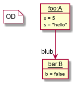
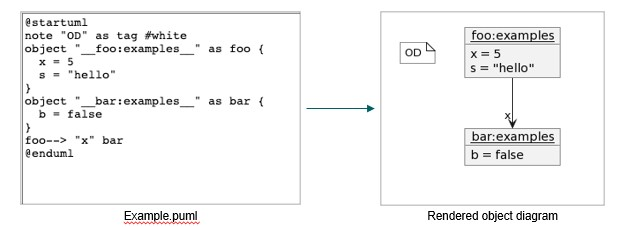

# Object Diagram PlantUML Tool (`ODPlantUMLTool`)

The [`ODPlantUMLTool`](ODPlantUMLTool.java) is a pretty printer for MontiCore Object Diagrams (ODs).
It transforms OD models into PlantUML text and then renders that text as an image.
Most OD information is preserved during the transformation, but some details (for example attribute types)
are currently not included in the generated PlantUML output.

## Usage of ODPlantUMLTool

### Dependencies
* Java 21 (or higher)
* Gradle 8.5 (or higher)

### Installation of the project
* Clone the project from Gitlab
* This project has **no Gradle wrapper** (`gradlew` is not part of the repository).
* Ensure Gradle is installed locally and available on your `PATH`.
```shell
gradle clean build
```

### Running the application

* The tool can be found here: [ODPlantUMLTool](ODPlantUMLTool.java)


* Example invocations:
   * Generate image output to file:
      * ``` -i gentest/src/main/resources/Example.od -pp diagram.png ```
   * Print PlantUML text to stdout:
      * ``` -i gentest/src/main/resources/Example.od -pp ```
   * Use external symbol table and symbol path(s):
      * ``` -i gentest/src/main/resources/Example.od -s gentest/src/main/resources/symboltable -path some/symbol/dir -path another/symbol/dir -pp diagram.png ```


* Explanation of the CLI arguments:
   * ``` -h ``` / ``` --help ``` prints CLI help and exits.
   * ``` -i ``` / ``` --input <file> ``` is **mandatory** and specifies the input `Object Diagram` model.
   * ``` -pp ``` / ``` --prettyprint [file] ``` is optional:
      * with a file argument, output is written/rendered to that file,
      * without a file argument, generated PlantUML text is printed to stdout.
   * ``` -s ``` / ``` --symboltable <file> ``` is optional and loads a symbol table from file.
     If omitted, the symbol table is derived from the AST.
   * ``` -path <dirlist> ``` is optional and can be provided multiple times to configure symbol paths.
   * If ``` -i ``` is missing, the tool prints help and exits.

### Limitation of the Tool
* Handling of Complex `Object Diagrams` with lists of objects:
   * The tool is not capable of handling OD models which have nested lists of objects within a given object.
   * An Example is shown below where we have a nested list of `cars` within an object `alice`:

```text
objectdiagram MyFamily {
  alice:Person {
    age = 29;
    cars = [
      :BMW {
        bought = 2020-01-05 15:30:00;
        color = BLUE;
      },
      tiger:Jaguar {
        bought = 2000/01/05 15:00:00;
        color = RED;
        length = 5.3;
      }
    ];
  };
  bob:Person {
    nicknames = ["Bob", "Bobby", "Robert"];
    cars -> tiger;
  };
  link married alice <-> bob;
}
```

## How the Tool Works

### Step 1: Parse the Object Diagram

The tool reads an Object Diagram model and parses it into an Abstract Syntax Tree (AST)
based on the OD4Development grammar.

### Example OD Input

```text
objectdiagram Examples {

  foo: A {
    int x = 5;
    java.lang.String s = "hello";
  };

  bar: B {
    boolean b = false;
  };

  link foo -> (blub) bar;

}
```

ODs may contain nested objects and expressions.
Objects and attributes are typically typed (for example `A` and `B`), and links are modeled similarly to
MontiCore class diagram associations.


<br><b>Figure 1:</b> The OD <code>Examples</code> in graphical syntax.

### Step 2: Pretty Print the OD to PlantUML

The tool uses MontiCore's visitor and handler infrastructure to traverse the AST and generate PlantUML text.

1. The tool uses the [Monticore](https://monticore.github.io/monticore/) `Visitor` and
   `Handler` Infrastructure to iterate through the AST nodes and pretty prints the
   PlantUML model.
2. Detailed Implementation can be found here:
   [PlantUMLODFullPrettyPrinter](PlantUMLODFullPrettyPrinter.java)

This is the pretty-printed PlantUML model by the ODPlantUMLTool, which contains most of the
OD information (but missing e.g. attribute types):

```text
@startuml
note "OD" as tag #white
object "__foo:A__" as foo {
  x = 5
  s = "hello"
}
object "__bar:B__" as bar {
  b = false
}
foo--> "blub" bar
@enduml
```

**Step 3. Generate an image representing the OD as image.**

1. The tool uses the PlantUML Java library to take the pretty printed
   PlantUML text as input and generates an image representing the OD.
2. Detailed Implementation can be found here: [generateImage](ODPlantUMLTool.java)



<br><b>Figure 2:</b> Generation of Object Diagram from PlantUML Model.


## Further Information

* [Project root: MontiCore @github](https://github.com/MontiCore/monticore)
* [MontiCore documentation](http://www.monticore.de/)
* [**List of languages**](https://github.com/MontiCore/monticore/blob/opendev/docs/Languages.md)
* [**MontiCore Core Grammar
  Library**](https://github.com/MontiCore/monticore/blob/opendev/monticore-grammar/src/main/grammars/de/monticore/Grammars.md)
* [Best Practices](https://github.com/MontiCore/monticore/blob/opendev/docs/BestPractices.md)
* [Publications about MBSE and MontiCore](https://www.se-rwth.de/publications/)
* [Licence definition](https://github.com/MontiCore/monticore/blob/master/00.org/Licenses/LICENSE-MONTICORE-3-LEVEL.md)

[od4report-link]: http://www.monticore.de/download/MCOD4Report.jar

[od4dev-link]: http://www.monticore.de/download/MCOD4Development.jar
