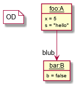
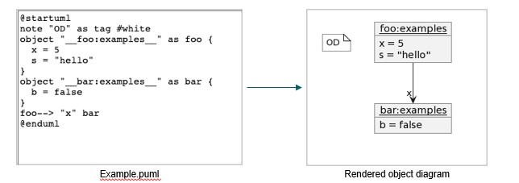

# Object Diagram PlantUML Tool (ODPlantUMLTool)

The [ODPlantUMLTool](ODPlantUMLTool.java) is a Pretty Printer primarily used to pretty print 
*MontiCore's Object Diagram* models first into the PlantUML syntax and then generate 
the object diagrams as a diagrammatic image. Most of the information is kept, but some, e.g. 
attribute types are lost.

## Internal Structure of the Functionality

**Step 1. Parse the Object Diagrams**

1. The tool takes an Object Diagrams as input and parses it into 
its abstract syntax tree (AST) based on the 
[OD4Report](../../../grammar) grammar.

### Example Object Diagram

Below is an OD defined as in MontiCore's textual notation:

``` 
objectdiagram Examples {

  foo: A {
    int x = 5;
    java.lang.String s = "hello";
  };

  bar: B {
    boolean b = false;
  };

  link foo -> (blub) bar;

}
```

Objects in ODs can also be nested, expressions be used to define values. Objects and attributes 
are generally typed (here e.g. `A`, `B`), links can be explicitly defined quite like in
MontiCore's class diagrams. Further extensions e.g. through language composition allow
various forms and uses object diagrams. 


<br><b>Figure 1:</b> The OD ```Example``` in graphical syntax.


**Step 2. Pretty Print the Object Diagram as a PlantUML text.**

1. The tool uses the [Monticore](https://monticore.github.io/monticore/) `Visitor` and 
   `Handler` Infrastructure to iterate through the AST nodes and pretty prints the 
   PlantUML model.
2. Detailed Implementation can be found here: 
   [PlantUMLODFullPrettyPrinter](PlantUMLODFullPrettyPrinter.java)

This is the pretty-printed PlantUML model by the ODPlantUMLTool, which contains most of the
OD information (but missing e.g. attribute types):  

``` 
@startuml
note "OD" as tag #white
object "__foo:A__" as foo {
  x = 5 
  s = "hello"
}
object "__bar:B__" as bar {
  b = false 
}
foo--> "blub" bar
@enduml
```

**Step 3. Generate an image representing the OD as image.**

1. The tool uses the PlantUML Java library to take the pretty printed 
   PlantUML text as input and generates an image representing the OD.
2. Detailed Implementation can be found here: [generateImage](ODPlantUMLTool.java) 



<br><b>Figure 2:</b> Generation of Object Diagram from PlantUML Model.


## Usage of ODPlantUMLTool

### Dependencies 
* Java 11 (or higher)
* Gradle 7.5 (or higher)

### Installation of the project
* Clone the project from Gitlab
* run *./gradlew clean*
* run *./gradlew build*

### Running the application

* The tool can be found here: [ODPlantUMLTool](ODPlantUMLTool.java)


* Run the Tool using the following CLI arguments:
  * ``` -i gentest/src/main/resources/Example.od -s gentest/src/main/resources/symboltable -pp diagram.png ```


* Explanation of the CLI arguments:
    * ``` -i ``` flag is used to specify the location of the input `Object Diagram` model
    * ``` -s ``` flag is used to specify the location of the symbol table that must be used by the `Pretty Printer`.
    * ``` pp ``` flag is used to specify the name of the output image of the `Object Diagram` that is generated from the pretty printed `PlantUML` model.
    * These arguments values can be *modified according to individual user's requirements* like format of images (png, jpeg), location of models etc.


* To view the pretty printed `PlantUML` model, then following steps must be performed: 
    * Navigate to the tool: [ODPlantUMLTool](ODPlantUMLTool.java)
    * Move to the `prettyPrint` function at `Line 124`
    * Add and additional fragment to print the result `PlantUML model` at `Line 127` : Log.info(result,"INFO");
    * Build the project again.
    * Run the `PlantUML` Tool using suitable CLI arguments.
    * The pretty printed `PlantUML` model will be available in the logs.

### Limitation of the Tool
* Handling of Complex `Object Diagrams` with lists of objects:
  * The tool is not capable of handling OD models which have nested lists of objects within a given object.
  * An Example is shown below where we have a nested list of `cars` within an object `alice`:

``` 
objectdiagram MyFamily {
  alice:Person {
    age = 29;
    cars = [
      :BMW {
        bought = 2020-01-05 15:30:00;
        color = BLUE;
      },
      tiger:Jaguar {
        bought = 2000/01/05 15:00:00;
        color = RED;
        length = 5.3;
      }
    ];
  };
  bob:Person {
    nicknames = ["Bob", "Bobby", "Robert"];
    cars -> tiger;
  };
  link married alice <-> bob;
}
```


## Further Information

* [Project root: MontiCore @github](https://github.com/MontiCore/monticore)
* [MontiCore documentation](http://www.monticore.de/)
* [**List of languages**](https://github.com/MontiCore/monticore/blob/opendev/docs/Languages.md)
* [**MontiCore Core Grammar
  Library**](https://github.com/MontiCore/monticore/blob/opendev/monticore-grammar/src/main/grammars/de/monticore/Grammars.md)
* [Best Practices](https://github.com/MontiCore/monticore/blob/opendev/docs/BestPractices.md)
* [Publications about MBSE and MontiCore](https://www.se-rwth.de/publications/)
* [Licence definition](https://github.com/MontiCore/monticore/blob/master/00.org/Licenses/LICENSE-MONTICORE-3-LEVEL.md)

[od4report-link]: http://www.monticore.de/download/MCOD4Report.jar

[od4data-link]: http://www.monticore.de/download/MCOD4Data.jar
